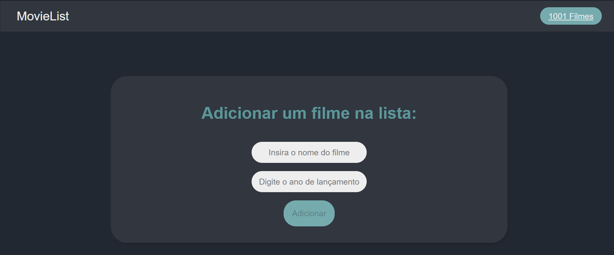

# Lista de Filmes

Um aplicativo de criação e gerenciamento de lista de filmes criado com React e TypeScript.
Também é possuivél visualisar todos os 1001 filmes presentes no livro " 1001 filmes para ver antes de morrer" e selecionar os filmes que já assistiu e eles serão salvos no localStorage, armazenando seu progresso.

## Interface

<div align="center">
  
</div>

## Tecnologias Utilizadas

- React
- TypeScript

## Status


## Descrição

O projeto **Lista de Filmes** é um aplicativo web que permite aos usuários adicionar filmes a uma lista, garantindo que não haja filmes duplicados.

Quando um filme duplicado é adicionado, uma mensagem de erro é exibida por um breve período.

## Funcionalidades

- Adicionar filmes à lista com nome e ano de lançamento.
- Exibir lista de filmes adicionados.
- Prevenir a adição de filmes duplicados com mensagens de erro.

### Componentes

- **Formulario**: Componente responsável por capturar os dados do novo filme e submetê-los.
- **ListaDeFilmes**: Componente responsável por exibir a lista de filmes adicionados.

## Como Usar

### Pré-requisitos

- Node.js
- npm ou yarn

### Passo a Passo

1. **Navegue até o Diretório do Projeto**

   ```bash
   cd diretorioProjeto
   ```

## Explicação

`App.tsx:` Este arquivo contém a lógica principal do aplicativo. Ele gerencia o estado da lista de filmes e a mensagem de erro para filmes duplicados.

`useState:` Utilizado para gerenciar o estado dos filmes e da mensagem de erro.

`adicionarFilme:` Função que adiciona um novo filme à lista, garantindo que não haja duplicatas.

`Formulario:` Componente que captura os dados do novo filme.

`ListaDeFilmes:` Componente que exibe a lista de filmes adicionados.

`Mensagem de Erro:` Renderiza uma mensagem de erro quando um filme duplicado é adicionado.

## Autor

Desenvolvido por Diego Franco.
